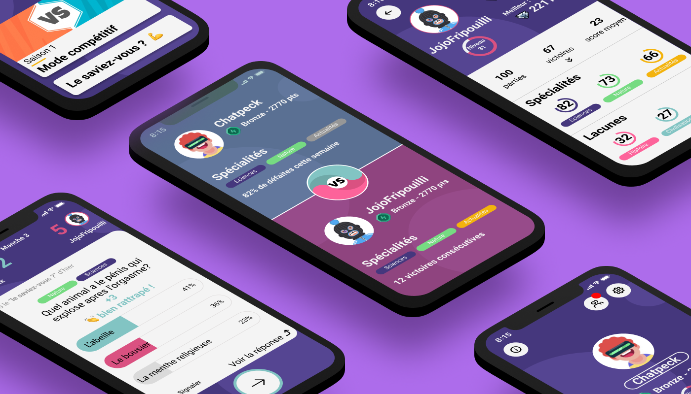
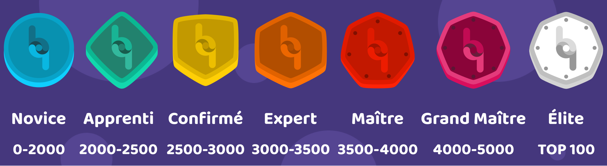
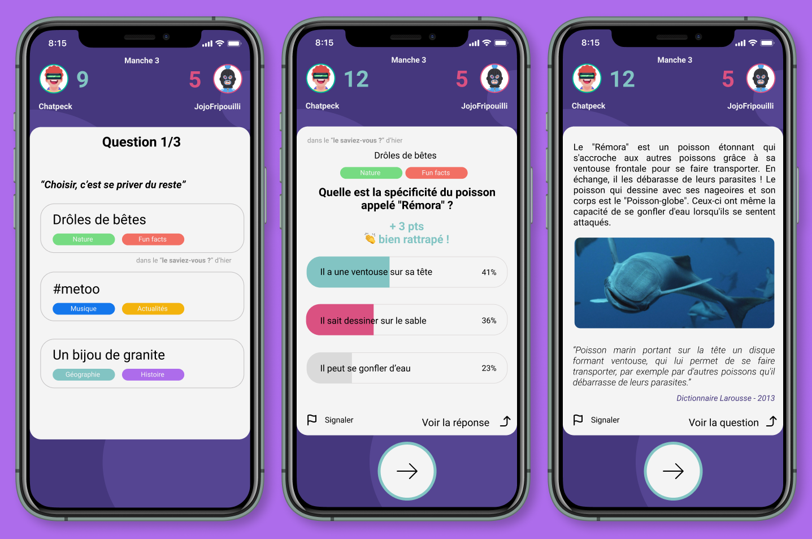
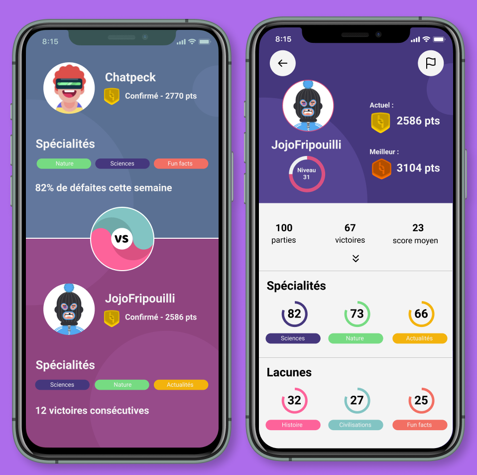

Nous sommes **Loïc** et **Jocelyn**, deux amis nantais passionnés de jeux et d’aventures !  
En jouant ensemble à des jeux de quiz sur mobile, on a fait le constat suivant : **c’est amusant mais frustrant !**

## “C’est amusant ou c’est frustrant ?”

Dans un jeu de quiz sur mobile, que tu aies la bonne réponse ou non, tu enchaînes les questions sans explications précises. Au final, tu as cette désagréable impression d’étaler tes connaissances sans véritablement comprendre ni apprendre.

A la frustration, **nous préférons le plaisir** : le plaisir d’apprendre, le plaisir de progresser, le plaisir de jouer !

## Et hop … BattleQuiz est né !

  

Un jeu de **quiz compétitif** qui a pour objectif de permettre aux gens d’**améliorer leur culture G** et de s’informer sur les actualités du monde tout en s’amusant. Cool, non ?

## “Compétitif vous avez dit ?”

  

Nous avons élaboré **un système de points de type ELO composé de 7 rangs**.
Jouer contre vos amis ou contre un redoutable adversaire aléatoire vous fera évoluer dans le classement. Tous les 2 mois, à la fin de chaque saison, vous gagnerez un lot de récompense en fonction de votre rang.

  

Qui seront les premiers à se hisser au rang d’Élite ? 💪

 <!--accéder Qui seront les premier à se hisser au sommets du classement? https://media.giphy.com/media/xTg8B9yQqY3JAK7OOQ/giphy.gif" width="500"-->
 
## Gagner c’est bien, progresser c’est mieux !

**Apprendre, c’est le cœur de notre projet**. Au programme :
- des questions originales **adaptées au niveau des joueurs**
- **une seconde chance** si vous n’avez pas trouvé du premier coup
- **des explications inédites** basées sur des citations et des sources fiables permettant au joueur de mieux retenir l’information et d’en apprendre plus sur le sujet !
- **des questions liées entre elles par leurs explications**: soyez-attentifs, vous augmenterez vos chances de gagner !
- **une rubrique “Le saviez-vous ?”** pour ne jamais en finir d’apprendre et de s’améliorer entre vos parties !

  

## STRA-TÉ-GIE!

  

Pour faire son choix, le joueur pourra voir les thèmes associés à chaque question mais aussi une phrase d’accroche qui donnera un indice sur le contenu de la question.

Assurez-vous de bien analyser le profil de votre adversaire afin de choisir les questions qui le mettront en difficulté ! Pour vous faire gagner du temps, les points forts et faibles de chaque joueur sont mis en avant sur leur profil.
Pour les futures versions, nous travaillons sur des mécanismes permettant plus d’interactions et d’adaptation à l’adversaire.

## Financement

Face aux nombreuses expériences de jeux en ligne saturés de publicités commerciales désagréables et inutiles, nous souhaitons libérer votre temps de cerveau disponible pour le consacrer à la curiosité, l’apprentissage et le divertissement !

  

  Fini les 30 secondes de pub obligatoire à chaque partie ! 🙏

Le financement se basera sur **un système de comptes Premium et de points de crédits** destinés à la customisation des profils des joueurs.

## “... Et ça avance?”

Et oui Jamy 😉 :
- [x] &nbsp; ~~Création des maquettes de design~~
- [ ] &nbsp; **(en cours)** Développement d’un premier prototype pour nos ambassadeurs (proches, collègues, ...)
- [ ] &nbsp; **(en cours)** Création de contenu (base de ~2000 questions)
- [ ] &nbsp; Prise en compte des retours et lancement de la version Beta fermée
- [ ] &nbsp; Création de contenus débloquables et achetables (avatars) à l'aide d'un designer
- [ ] &nbsp; Implémentation des accès Premium (via AppStore / PlayStore)
- [ ] &nbsp; Ouverture de l’application Beta à tout le monde et lancement de la Saison 1

  

  Prepare for battle... Quiz !

